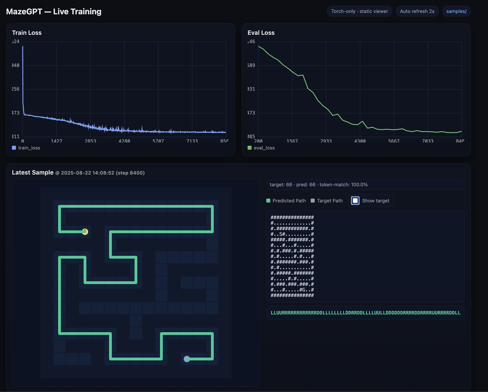

# MazeGPT
Train tiny gpt to solve maze with live training viewer



Run with
```bash
python train.py --device auto --maze-h 15 --maze-w 15 \
  --seq-len 1024 --batch-size 32 --steps 20000 \
  --eval-interval 200 --sample-interval 200 --save-interval 2000 \
  --port 7860 --amp bf16
```
